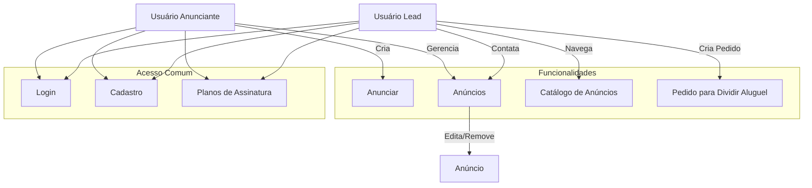

# Creating a Markdown document with the content provided about the MicroSaaS plan.

# Plano do MicroSaaS - Plataforma de Anúncios de Imóveis

## Objetivo

A plataforma visa conectar anunciantes (proprietários de imóveis) com leads (inquilinos em potencial) para facilitar o aluguel ou a divisão de imóveis. A ideia é permitir a publicação e gerenciamento de anúncios e simplificar o contato entre as partes interessadas.

---

## Funcionalidades do Sistema

1. **Cadastro e Login:**

   - **Anunciante**: Criação de conta com detalhes do perfil e verificação de identidade.
   - **Lead**: Criação de conta gratuita para procurar imóveis.

2. **Anúncios de Imóveis:**

   - **Anunciante**: Pode criar e gerenciar anúncios (com fotos, detalhes e preço).
   - **Lead**: Pode criar um pedido para dividir aluguel (compartilhar espaço).

3. **Navegação e Filtros:**
   - **Lead**: Pode buscar anúncios com base em filtros como localidade, preço e tipo de imóvel.
4. **Sistema de Contato:**

   - **Lead**: Entra em contato diretamente com o anunciante.
   - **Anunciante**: Recebe e gerencia contatos e pode responder interessados.

5. **Assinaturas:**
   - Planos mensais para anunciantes com diferentes níveis de visibilidade dos anúncios.
   - Leads têm acesso gratuito, mas podem pagar para acessar recursos premium (como ver mais anúncios ou contatar mais pessoas).

---

## Diagrama de Sistema

O diagrama acima representa as duas personas principais:

- **Anunciante** pode criar e gerenciar anúncios.
- **Lead** pode navegar, contatar e procurar opções de compartilhamento.

---

## Exemplo de Plano de Assinatura:

1. **Plano Básico**:

   - Preço: R$ 29,90/mês
   - Permite criar até 3 anúncios.
   - Suporte básico e anúncios visíveis por 30 dias.

2. **Plano Premium**:

   - Preço: R$ 59,90/mês
   - Criação ilimitada de anúncios.
   - Anúncios com destaque na plataforma.
   - Contato direto com leads ilimitados.

3. **Plano Ultimate**:
   - Preço: R$ 99,90/mês
   - Todas as funcionalidades do Premium.
   - Consultoria personalizada para aumentar a visibilidade dos anúncios.
   - Publicidade em redes sociais conectada à plataforma.
     """

